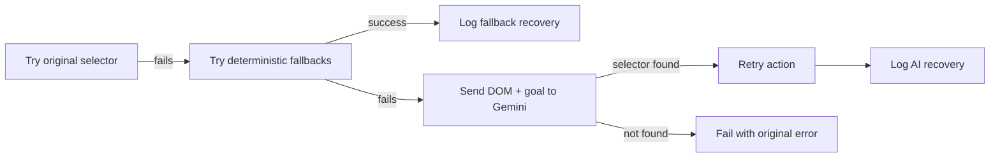

# QA Expert Lab: AI Self-Healing TestOps Suite

[](https://github.com/avanvaghani/ai-self-healing-playwright/actions/workflows/ci.yml)

A resume-ready QA automation project built with **Playwright**, **TypeScript**, **Google Gemini**, and **GitHub Actions**.

It demonstrates a practical modern QA workflow: detect broken selectors, recover stable locators, validate UI/API/accessibility/performance quality gates, and publish evidence that a reviewer can inspect from CI artifacts.

## Why This Project Stands Out

- **Self-healing UI actions:** `smartFill` and `smartClick` try the original selector, deterministic fallbacks, then Gemini-assisted healing.
- **Auditable recovery evidence:** healed selector events are written to `reports/healed-selectors.*.json` and merged into `reports/healed-selectors.json`.
- **API contract checks:** local API fixtures are validated with strict, actionable schema errors.
- **Accessibility gate:** checkout flow is scanned with `@axe-core/playwright`.
- **Performance budget:** local UI/API checks assert fast response and render timing.
- **Semantic visual QA:** Gemini Vision can compare screenshots and return structured regression analysis.
- **CI-ready reporting:** GitHub Actions uploads Playwright reports and a QA Intelligence report.

## Quality Gates

| Gate            | Evidence                                                       |
| --------------- | -------------------------------------------------------------- |
| Self-healing UI | Broken login/checkout selectors recovered by fallback or AI    |
| API contract    | Valid and invalid order payloads checked with typed validators |
| Accessibility   | Axe scan blocks serious/critical checkout violations           |
| Performance     | Navigation and API response budgets checked in Playwright      |
| Visual QA       | Gemini Vision validates screenshot comparison payloads         |
| Flake analysis  | Repeated selector healing is grouped into actionable signals   |

## Architecture

```text
.
├── demo/                         # Local UI and API fixtures with intentional change modes
├── scripts/qa-report.mjs          # Generates QA Intelligence artifacts
├── src/
│   ├── fixtures/ai-fixtures.ts    # smartPage fixture with fallback + AI healing
│   ├── types/qa-report.ts         # Public report interfaces
│   └── utils/                     # AI, contract, scenario, and report helpers
├── tests/                         # UI, API, a11y, performance, visual tests
├── .github/workflows/ci.yml       # CI quality pipeline and artifact upload
└── playwright.config.ts
```

## Healing Flow



## Quick Start

### Prerequisites

- Node.js 18+
- npm 9+
- Optional: `GEMINI_API_KEY` for Gemini selector/visual analysis

### Install

```bash
npm install
npx playwright install
```

### Run

```bash
npm run qa:ci       # Full local quality pipeline
npm run qa:demo     # Focused self-healing demo
npm run qa:report   # Generate reports/quality-summary.md
```

Useful targeted commands:

```bash
npm run test:unit
npm run test:api
npm run test:a11y
npm run test:perf
npm run typecheck
npm run lint
```

## QA Intelligence Report

After a test run, generate the portfolio artifact:

```bash
npm run qa:report
```

Generated files:

| File                            | Purpose                                  |
| ------------------------------- | ---------------------------------------- |
| `reports/quality-summary.md`    | Human-readable QA summary for CI review  |
| `reports/quality-summary.json`  | Structured quality gate summary          |
| `reports/healed-selectors.json` | Merged selector recovery evidence        |
| `reports/flake-analysis.json`   | Repeated healing and AI recovery signals |

CI uploads both `playwright-report` and `qa-intelligence-report` artifacts.

## Demo

The demo shows Playwright recovering from selectors that intentionally break at runtime.


## Test Scenarios

| ID          | Scenario                                                           | Gate          | Risk                           |
| ----------- | ------------------------------------------------------------------ | ------------- | ------------------------------ |
| QA-UI-001   | Login flow recovers dynamic authentication selectors               | Self-healing  | Authentication locator drift   |
| QA-UI-002   | Checkout recovers dynamic IDs, class renames, and CTA text changes | Self-healing  | Checkout locator drift         |
| QA-API-001  | Valid order API response satisfies the contract                    | API contract  | API schema compatibility       |
| QA-API-002  | Invalid order payload returns actionable validation errors         | API contract  | API defect diagnosis           |
| QA-A11Y-001 | Checkout page has no serious accessibility violations              | Accessibility | Accessible checkout completion |
| QA-PERF-001 | Checkout UI/API stays inside local performance budgets             | Performance   | User-perceived speed           |
| QA-VIS-001  | Gemini Vision validates screenshot analysis payloads               | Visual QA     | Visual regression triage       |

## Gemini Usage

Gemini is called only when deterministic recovery is not enough or when the visual QA test is explicitly enabled with `GEMINI_API_KEY`.

The selector healing prompt sends:

- failing selector
- action goal
- current page DOM

The visual QA prompt sends:

- baseline screenshot
- current screenshot
- required JSON output shape

AI-backed tests are designed as evidence, not as hidden magic. Every recovery is logged so the locator strategy can be reviewed later.

## Resume Positioning

**AI Self-Healing TestOps Suite | Playwright, TypeScript, GitHub Actions, API Testing, Visual QA, Accessibility**

- Built an AI-assisted QA automation platform that recovers broken selectors, detects visual regressions, validates APIs, and publishes CI quality reports.
- Implemented structured failure evidence including healed selector logs, flaky-test analysis, screenshots, traces, and quality gate summaries.
- Designed a maintainable Playwright framework with fixtures, typed utilities, CI workflows, and report artifacts for real-world QA review.

## License

MIT
