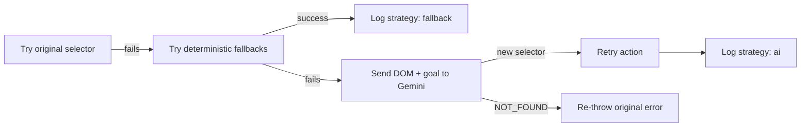

# AI Self-Healing and Visual QA with Playwright

[](https://github.com/avanvaghani/ai-self-healing-playwright/actions/workflows/ci.yml)

An AI-enhanced QA automation project built with **Playwright**, **TypeScript**, and **Google Gemini**.  
It demonstrates two practical ideas for modern test engineering:

- resilient selector recovery when UI locators break
- semantic visual regression analysis instead of pixel-only noise

## Why This Project Stands Out

- **Self-healing actions:** `smartFill` and `smartClick` attempt the original selector, then deterministic fallback strategies, then Gemini healing.
- **Semantic visual checks:** Gemini compares baseline and current screenshots and returns structured JSON (`isRegression` + explanation).
- **Execution evidence:** selector recoveries are written to `healed-selectors.json` with strategy metadata.
- **CI ready:** GitHub Actions workflow runs type-check + Playwright tests and uploads the Playwright report artifact.

## Healing flow

`smartClick` / `smartFill` only call Gemini **after** the primary selector fails — not on every action.



## Architecture

```text
.
├── demo/                     # Local demo app with intentionally unstable selectors
├── src/
│   ├── fixtures/
│   │   └── ai-fixtures.ts    # smartPage fixture (retry + fallback + AI healing)
│   └── utils/
│       └── ai.ts             # Gemini integration for selector + visual analysis
├── tests/
│   ├── self-healing.spec.ts
│   └── smart-visual.spec.ts
├── .github/workflows/ci.yml  # CI pipeline
└── playwright.config.ts
```

## Healing strategies (current demo)

| Order | Strategy | When it runs |
|------:|----------|----------------|
| 1 | **Original selector** | First attempt (`click` / `fill` with timeout). |
| 2 | **Fallback CSS** | If the action goal mentions username, password, or login, tries placeholder/type/text-based selectors (see `src/fixtures/ai-fixtures.ts`). |
| 3 | **AI healing** | If fallbacks fail, sends full page HTML + goal to Gemini; expects a single CSS/XPath string or `NOT_FOUND`. |

The demo app (`demo/index.html`) randomizes element IDs on load to simulate **dynamic ID** breakage. Expanding scenarios (class rename, DOM moves, label text changes) is a natural next step for more specs.

## Quick Start

### Prerequisites
- Node.js 18+ (see `package.json` → `engines`)
- Gemini API key (for AI tests and CI)

### Install
```bash
npm install
npx playwright install
```

The second command downloads Chromium, Firefox, and WebKit binaries for Playwright. CI uses `playwright install --with-deps` automatically.

### Environment
Copy the example file and edit:

```bash
cp .env.example .env
```

On Windows PowerShell: `Copy-Item .env.example .env`

Set `GEMINI_API_KEY` in `.env` (never commit `.env`).

## Run Locally

```bash
npm test
```

Useful commands:

```bash
npm run typecheck
npm run test:headed
npm run test:ui
npm run report
```

## Cost, limits, and production use

- **Gemini API calls cost money** and count against your quota. This repo calls the API only when a selector heal or visual analysis runs, not on every step.
- **CI:** add `GEMINI_API_KEY` as a GitHub Actions secret so tests do not skip; be aware each run may incur API usage.
- **Rate limits / caching:** there is no caching layer in this demo. For real products, consider caching DOM hashes → resolved selectors, backoff on 429, and strict budgets per run.

Dependency note: **`@google/genai`** is Google’s GenAI SDK for JavaScript/TypeScript. If a version looks unfamiliar, run `npm view @google/genai version` and align with [the package’s release notes](https://www.npmjs.com/package/@google/genai).

## Prompt transparency (high level)

Selector healing (`healSelector` in `src/utils/ai.ts`) sends Gemini:

- the failing selector and a short **goal** string (what the test is trying to do)
- the **full page HTML** as context (fine for a toy demo; production code should trim or scope the DOM)

Visual analysis (`analyzeVisualDiff`) sends:

- instructions to compare baseline vs current screenshots and return **JSON** with `isRegression` and `explanation`
- two PNG images as inline data

## CI Pipeline

The GitHub workflow:
- installs dependencies and **Chromium, Firefox, and WebKit**
- runs TypeScript checks
- executes Playwright tests
- uploads `playwright-report` as an artifact

## Example Healing Log

`healed-selectors.json` entries include:
- original selector
- recovered selector
- action goal
- recovery strategy (`fallback` or `ai`)
- timestamp and URL

This makes test recovery auditable and useful for improving locator design.

## Results (fill after a run)

After a local or CI run, you can summarize recoveries from `healed-selectors.json`:

| Metric | Example |
|--------|---------|
| Total heal events | *e.g. 6* |
| Resolved by **fallback** | *e.g. 100%* |
| Resolved by **AI** | *e.g. 0%* |

Low **AI** percentage on the current demo is expected: fallbacks often succeed before Gemini runs.

## Demo

Record a short terminal or headed run and save as `docs/assets/self-healing-demo.gif`, then commit it.


## Notes

- AI-based tests are skipped when `GEMINI_API_KEY` is missing.
- The included `demo` app intentionally mutates element IDs to simulate real-world flaky locator failures.

## Contributing

See [CONTRIBUTING.md](CONTRIBUTING.md).

## License

MIT
