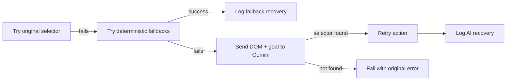

# AI Self-Healing Playwright

[](https://github.com/avanvaghani/ai-self-healing-playwright/actions/workflows/ci.yml)
[](https://playwright.dev/)
[](https://www.typescriptlang.org/)
[](https://ai.google.dev/)
[](https://nodejs.org/)
[](https://opensource.org/licenses/MIT)

> A Playwright + TypeScript test framework that **recovers broken locators automatically** — deterministic fallbacks first, Gemini-assisted healing when needed. Publishes auditable evidence for every recovery so the locator strategy can be reviewed.


---

## The Problem

UI tests break when selectors drift. Every renamed CSS class, every dynamic ID, every CTA text tweak — and the test suite goes red. Teams either over-engineer locator strategies upfront or pay maintenance cost forever.

This framework takes a different path: **try the original selector, then deterministic fallbacks, then use Gemini AI to recover** — and log every recovery as audit evidence.

---

## Current Outcomes

- **5 quality gates** — self-healing, API contract, accessibility, performance, visual QA
- **67 recovered selector events** captured in report evidence
- **Flake-prone selectors grouped** into actionable drift signals (`reports/flake-analysis.json`)
- **Zero hidden magic** — every AI recovery is logged with the failing selector, fallback path, and outcome

---

## Quick Start

```bash
npm install
npm run qa:demo        # runs the self-healing demo
npm run qa:report      # generates reports/quality-summary.md
```

After running, open:

- `playwright-report/index.html` — execution timeline
- `reports/quality-summary.md` — quality gate coverage
- `reports/healed-selectors.json` — selector recovery evidence

> AI healing requires `GEMINI_API_KEY`. Without it, deterministic fallbacks still run and non-AI tests pass normally.

---

## Healing Flow



---

## Quality Gates

| Gate            | What It Catches                                                |
| --------------- | -------------------------------------------------------------- |
| Self-healing UI | Broken login/checkout selectors recovered by fallback or AI    |
| API contract    | Valid and invalid order payloads checked with typed validators |
| Accessibility   | Axe scan blocks serious/critical checkout violations           |
| Performance     | Navigation and API response budgets checked in Playwright      |
| Visual QA       | Gemini Vision validates screenshot comparison payloads         |
| Flake analysis  | Repeated selector healing grouped into actionable signals      |

---

## Project Structure

```text
.
├── demo/                          # Local UI + API fixtures with intentional change modes
├── scripts/qa-report.mjs          # Generates QA Intelligence artifacts
├── src/
│   ├── fixtures/ai-fixtures.ts    # smartPage fixture with fallback + AI healing
│   ├── types/qa-report.ts         # Public report interfaces
│   └── utils/                     # AI, contract, scenario, report helpers
├── tests/                         # UI, API, a11y, performance, visual specs
├── .github/workflows/ci.yml       # CI quality pipeline + artifact upload
└── playwright.config.ts
```

---

## Test Scenarios

| ID          | Scenario                                                       | Gate          |
| ----------- | -------------------------------------------------------------- | ------------- |
| QA-UI-001   | Login flow recovers dynamic authentication selectors           | Self-healing  |
| QA-UI-002   | Checkout recovers dynamic IDs, class renames, CTA text changes | Self-healing  |
| QA-API-001  | Valid order API response satisfies the contract                | API contract  |
| QA-API-002  | Invalid order payload returns actionable validation errors     | API contract  |
| QA-A11Y-001 | Checkout page has no serious accessibility violations          | Accessibility |
| QA-PERF-001 | Checkout UI/API stays inside local performance budgets         | Performance   |
| QA-VIS-001  | Gemini Vision validates screenshot analysis payloads           | Visual QA     |

---

## Commands

```bash
# Full local quality pipeline (lint, typecheck, unit, e2e, report)
npm run qa:ci

# Focused self-healing demo
npm run qa:demo

# Generate the portfolio QA report
npm run qa:report

# Targeted gates
npm run test:unit
npm run test:api
npm run test:a11y
npm run test:perf
```

---

## Gemini AI Usage

Gemini is invoked **only** when deterministic recovery fails or when the visual QA test is explicitly enabled with `GEMINI_API_KEY`.

**Selector healing prompt** sends:

- failing selector
- action goal
- current page DOM

**Visual QA prompt** sends:

- baseline screenshot
- current screenshot
- required JSON output shape

Every Gemini call is logged with input/output so the locator strategy stays reviewable. This is built as **evidence, not magic**.

---

## QA Intelligence Report

| File                            | Purpose                                  |
| ------------------------------- | ---------------------------------------- |
| `reports/quality-summary.md`    | Human-readable QA summary for CI review  |
| `reports/quality-summary.json`  | Structured quality gate summary          |
| `reports/healed-selectors.json` | Merged selector recovery evidence        |
| `reports/flake-analysis.json`   | Repeated healing and AI recovery signals |

CI uploads both `playwright-report` and `qa-intelligence-report` as artifacts on every run.

---

## What This Demonstrates

- **Real-world flake mitigation** — not just retry-on-failure, but layered recovery with evidence
- **Responsible AI in testing** — deterministic-first, AI as fallback, every call logged
- **Multi-gate quality engineering** — UI, API, a11y, performance, visual under one framework
- **CI artifact discipline** — every run leaves auditable evidence behind
- **Cost-aware AI design** — Gemini is called only when cheaper recovery paths fail

---

## Prerequisites

- Node.js 18+
- npm 9+
- Optional: `GEMINI_API_KEY` for AI-assisted selector healing and visual QA

---

## License

MIT
