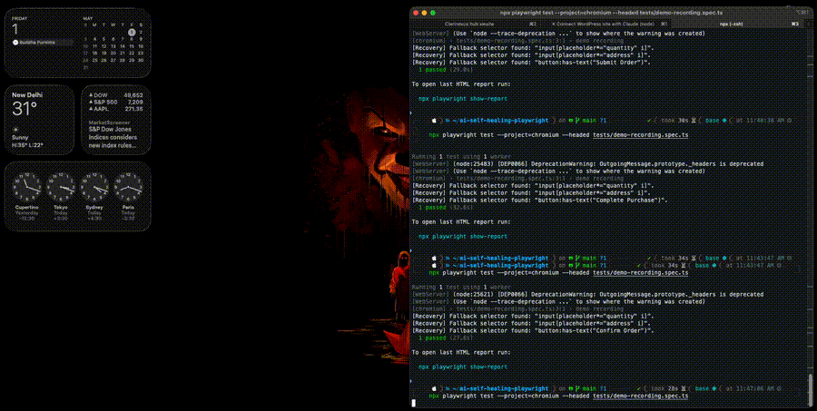

# AI Self-Healing and Visual QA with Playwright

[](https://github.com/avanvaghani/ai-self-healing-playwright/actions/workflows/ci.yml)

An AI-enhanced QA automation project built with **Playwright**, **TypeScript**, and **Google Gemini**.  
It demonstrates two practical ideas for modern test engineering:

- resilient selector recovery when UI locators break
- semantic visual regression analysis instead of pixel-only noise

## Why This Project Stands Out

- **Self-healing actions:** `smartFill` and `smartClick` attempt the original selector, then deterministic fallback strategies, then Gemini healing.
- **Semantic visual checks:** Gemini compares baseline and current screenshots and returns structured JSON (`isRegression` + explanation).
- **Execution evidence:** selector recoveries are written to `healed-selectors.json` with strategy metadata.
- **CI ready:** GitHub Actions workflow runs type-check + Playwright tests and uploads the Playwright report artifact.

## Architecture

```text
.
├── demo/                     # Local demo app with intentionally unstable selectors
├── src/
│   ├── fixtures/
│   │   └── ai-fixtures.ts    # smartPage fixture (retry + fallback + AI healing)
│   └── utils/
│       └── ai.ts             # Gemini integration for selector + visual analysis
├── tests/
│   ├── self-healing.spec.ts
│   └── smart-visual.spec.ts
├── .github/workflows/ci.yml  # CI pipeline
└── playwright.config.ts
```

## Quick Start

### Prerequisites
- Node.js 18+
- Gemini API key

### Install
```bash
npm install
```

### Environment
Create `.env` in the project root:

```env
GEMINI_API_KEY=your_api_key_here
```

## Run Locally

```bash
npm test
```

Useful commands:

```bash
npm run typecheck
npm run test:headed
npm run test:ui
npm run report
```

## CI Pipeline

The GitHub workflow:
- installs dependencies and Chromium
- runs TypeScript checks
- executes Playwright tests
- uploads `playwright-report` as an artifact

## Example Healing Log

`healed-selectors.json` entries include:
- original selector
- recovered selector
- action goal
- recovery strategy (`fallback` or `ai`)
- timestamp and URL

This makes test recovery auditable and useful for improving locator design.

## Demo

Add your self-healing run GIF at `docs/assets/self-healing-demo.gif` and keep this embed:

```md

```

## Notes

- AI-based tests are skipped when `GEMINI_API_KEY` is missing.
- The included `demo` app intentionally mutates element IDs to simulate real-world flaky locator failures.

## License

MIT
